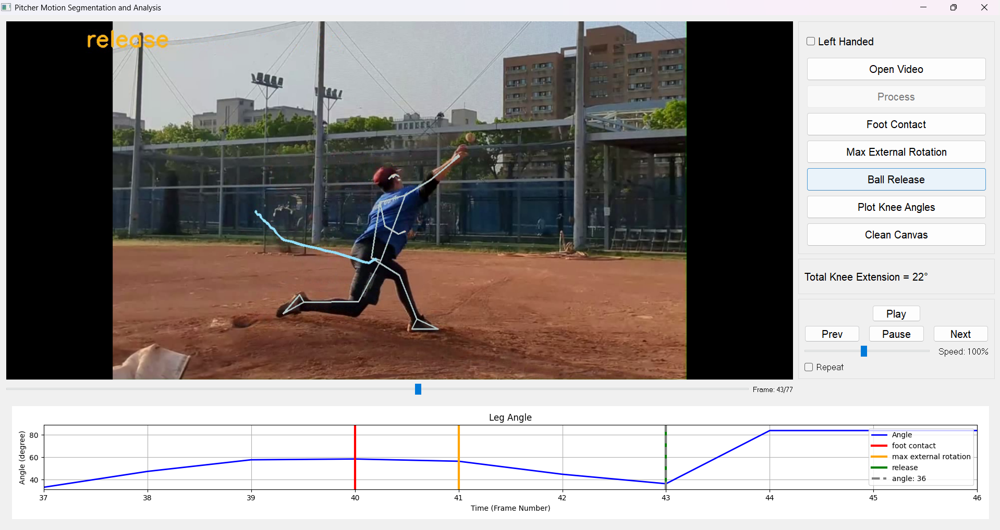
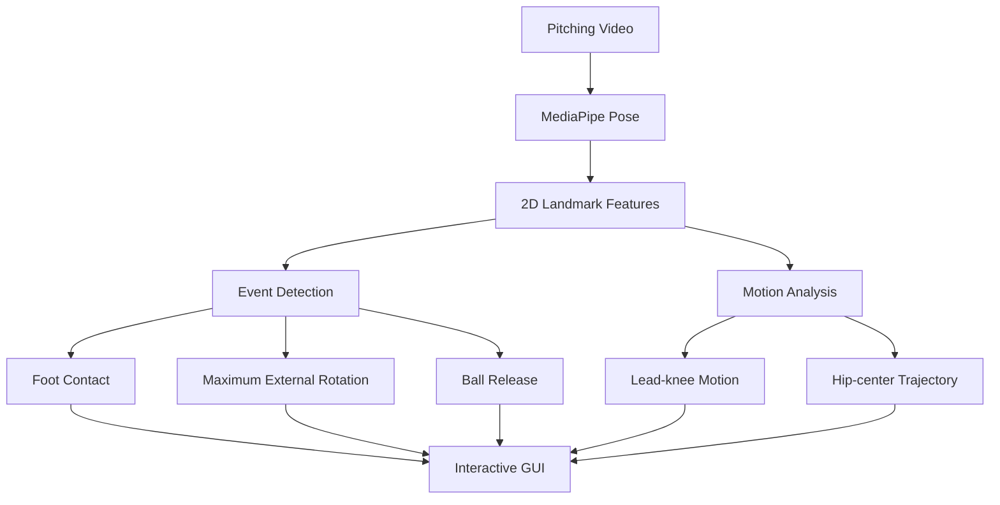
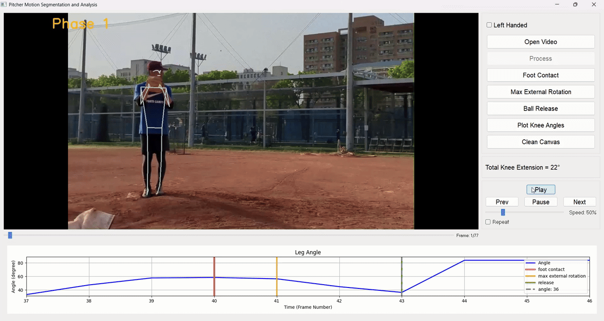

# Pitcher Motion Analysis

This was an undergraduate project focused on analyzing baseball pitching motion from ordinary side-view videos. The project was completed by a two-person team; I independently developed the pitching-analysis system presented in this repository, while my teammate developed a separate batting-analysis system.

The project started with a simple question: can key moments of a pitching motion be detected automatically from regular video without using a motion-capture system?

I used MediaPipe Pose to extract body landmarks and developed rule-based methods to locate three key pitching events:

- Foot Contact
- Maximum External Rotation
- Ball Release

As the project developed, I also added several motion-analysis features and a PyQt GUI so that the detected events and pitching motion could be reviewed more easily.



## Method Overview



The system first extracts 2D body landmarks from each video frame using MediaPipe Pose. I then use landmark positions, motion, and joint geometry to detect the three pitching events.

- **Foot Contact:** uses lead-foot movement, velocity, and landing behavior in a rule-based state sequence.
- **Maximum External Rotation:** approximates the timing of MER (Maximum External Rotation) from the 2D orientation of the throwing forearm during arm cocking.
- **Ball Release:** estimates release timing from shoulder, elbow, and wrist geometry rather than directly detecting the baseball.
- **Lead-knee analysis:** tracks the 2D angle formed by the hip, knee, and ankle.

The processed video also divides the pitching motion into phases based on the detected events.

## Motion Analysis and GUI

Detecting a few event frames alone gives limited information about the pitching motion, so I also used the same pose landmarks for several additional visualizations:

- Lead-knee angle over time and knee-extension change between pitching events
- Hip-center trajectory
- Pitching phases based on the detected events
- Frame-by-frame video review
- Direct navigation to Foot Contact, Maximum External Rotation, and Ball Release

The GUI was developed gradually alongside the detector as a way to inspect intermediate results, compare frames, and review the final analysis.


*Demo shown at 0.5× playback speed for clarity; playback speed does not represent processing speed.*

## Evaluation

The original undergraduate project was mainly evaluated visually while I developed the detector.

In 2026, I revisited the project and tested the original event-detection logic on six additional pitching clips that were separate from the original demo videos. I manually annotated the target events before running the detector.

For Maximum External Rotation and Ball Release, all six predictions were within the annotated range or one frame from the nearest boundary. For Foot Contact, four of the six predictions fell within the annotated first-contact range.

Foot Contact was less consistent because the original heuristic sometimes detected the planted or settled foot position rather than the first visible ground-contact frame.

This was a small evaluation added after the original undergraduate project, rather than a large-scale benchmark.

More details about the annotation definitions, per-clip results, and failure-mode notes are available in [docs/EVALUATION.md](docs/EVALUATION.md).

## Limitations

- All measurements come from monocular 2D pose estimation, so camera viewpoint and projection affect the results.
- The MER event is a timing proxy based on 2D forearm orientation, not a direct measurement of shoulder external rotation.
- Ball Release is inferred from arm geometry because the system does not directly track the baseball.
- Foot Contact can sometimes align more closely with foot planting than with strict first ground contact.
- The current evaluation set is small.

## Running the GUI

Tested with Python 3.11 on Windows.

```powershell
py -3.11 -m venv .venv
& .\.venv\Scripts\python.exe -m pip install -r requirements.txt
& .\.venv\Scripts\python.exe -c "import mediapipe, runpy; runpy.run_path('ui_responsive.py', run_name='__main__')"
```

Use Open Video to select a pitching video, then click Process.

The first launch may take slightly longer while MediaPipe initializes its pose model.

## Project Notes

This repository is a cleaned-up version of the original undergraduate project. The Foot Contact, Maximum External Rotation, and Ball Release detection logic is unchanged from the original implementation. When I revisited the project in 2026, I added a small evaluation and updated the GUI and documentation.
